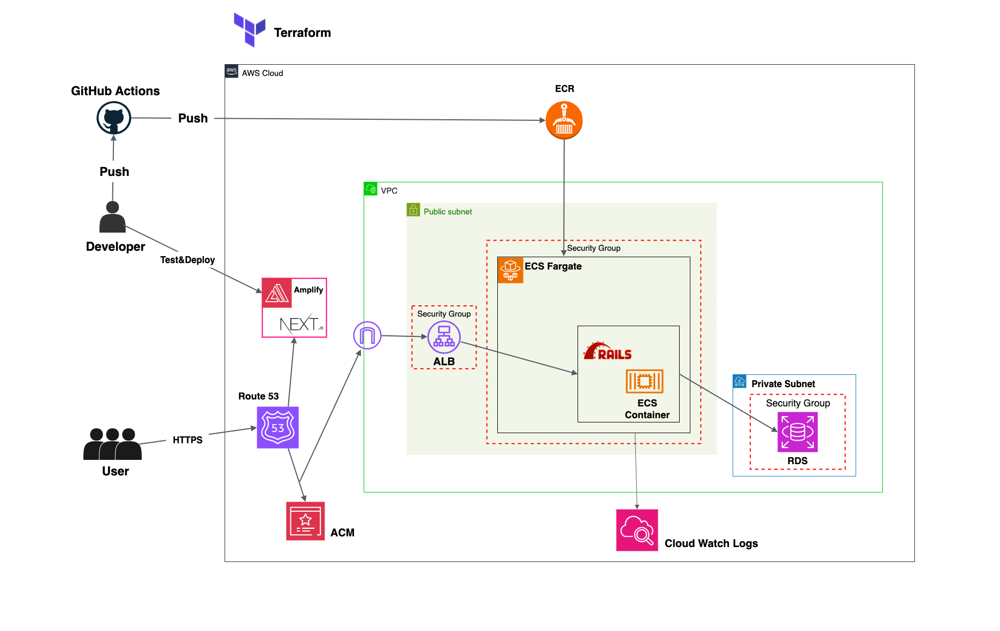

### 概要
PlusONEアプリのインフラをAWSで構築しました。

下記リンクからアクセスできます。
https://plusoneup.net

フロントエンド：https://github.com/NaaaRiii/RoulettePopup
バックエンド：https://github.com/NaaaRiii/plus_one

## インフラ構成図

## アーキテクチャ概要

Rails アプリケーションを AWS のマネージドサービスで構成しました。主に以下の AWS サービスを使用しています：

### フロントエンド（別途管理）
- **Next.js アプリケーション**: AWS Amplify でデプロイ・管理
- **ユーザー認証**: Amazon Cognito で認証・認可を処理
- **静的ホスティング**: Amplify の CDN 機能で高速配信

### バックエンド（Terraform で管理）
- **Rails API サーバー**: ECS Fargate でコンテナ実行
- **データベース**: Amazon RDS MySQL でデータ永続化
- **ロードバランシング**: Application Load Balancer で負荷分散

### ネットワーク層
- **VPC**: `10.0.0.0/16` の CIDR ブロックで作成
- **パブリックサブネット**: `ap-northeast-1a` と `ap-northeast-1c` の2つの AZ に配置
  - `10.0.1.0/24` (1a) と `10.0.4.0/24` (1c)
  - Application Load Balancer が配置される
- **プライベートサブネット**: 同じく2つの AZ に配置
  - `10.0.2.0/24` (1a) と `10.0.3.0/24` (1c)
  - RDS インスタンスが配置される
- **インターネットゲートウェイ**: パブリックサブネットからインターネットへの接続を提供

### コンピュータ層
- **ECS クラスター**: Fargate タイプでマネージドコンテナ実行環境を提供
- **ECS サービス**:
  - タスクのライフサイクル管理 - 常時1つのタスクを実行し、異常時は自動再起動
  - ロードバランサー連携 - ALB のターゲットグループにタスクを登録
  - ネットワーク設定 - パブリックサブネットでの実行とセキュリティグループにて制御
- **ECS タスク定義**:
  - CPU: 256 vCPU、メモリ: 512MB
  - Rails アプリケーションコンテナ（ポート3000）
  - 環境変数とシークレットを AWS Secrets Manager から取得
  - Cognito ユーザープール ID とアプリクライアント ID を環境変数で受け取る

### ロードバランシング
- **Application Load Balancer**: パブリックサブネットに配置
- **ターゲットグループ**: ECS タスクをターゲットとして設定
- **リスナー**: 
  - HTTP (80) → HTTPS (443) へのリダイレクト
  - HTTPS (443) → ECS タスク (3000) への転送
- **ヘルスチェック**: `/api/health` エンドポイントで監視

### データベース
- **Amazon RDS**: MySQL 8.0 エンジン
- **インスタンスタイプ**: `db.t3.micro`
- **ストレージ**: 20GB
- **配置**: プライベートサブネットの DB サブネットグループ内
- **セキュリティ**: ECS タスクからのみアクセス可能

### セキュリティ
- **セキュリティグループ**: ALB、ECS、RDS 用に個別に定義
- **IAM ロール**: ECS タスク実行用とタスク用の2つのロール
- **シークレット管理**: AWS Secrets Manager でデータベース認証情報やアプリケーションシークレットを管理
- **認証**: Cognito ユーザープールとの連携で JWT トークン検証

### DNS と TLS
- **Route 53**: `plusoneup.net` と `api-plusoneup.com` のホストゾーン
- **ACM 証明書**: `api-plusoneup.com` 用の TLS 証明書（DNS 検証）
- **自動更新**: 証明書は自動的に更新される

### コンテナレジストリ
- **ECR リポジトリ**: `plusone-rails` として作成
- **イメージスキャン**: プッシュ時に自動スキャン

### 監視とログ
- **CloudWatch ロググループ**: `/ecs/plusone-app` として作成
- **ログ保持期間**: 7日間
- **ログドライバー**: `awslogs` を使用

### トラフィックフロー
1. ユーザーが Next.js アプリケーション（Amplify）にアクセス
2. 認証が必要な場合は Cognito でログイン処理
3. API リクエスト時は `api-plusoneup.com` にアクセス
4. Route 53 が ALB の DNS 名を返す
5. ALB が HTTPS リクエストを受け取り、TLS を終端
6. ALB が ECS タスク（ポート3000）に HTTP で転送
7. ECS タスクがプライベートサブネットの RDS に接続してデータを取得
8. レスポンスが逆順でユーザーに返される

この構成により、フロントエンドとバックエンドを分離し、それぞれに最適な AWS サービスを使用したセキュアでスケーラブルな本番環境を実現しています。

## 構成要素

| レイヤー | AWS サービス | Terraform ファイル |
|---------|-------------|-------------------|
| ネットワーク | VPC、サブネット（パブリック・プライベート）、インターネットゲートウェイ、ルートテーブル、DB サブネットグループ | `vpc.tf` |
| セキュリティ | ALB、ECS、RDS、VPC エンドポイント用セキュリティグループ | `security_groups.tf` |
| コンピュート | ECS クラスター、Fargate サービス、タスク定義 | `ecs.tf` |
| コンテナレジストリ | ECR リポジトリ | `ecr.tf` |
| ロードバランシング | Application Load Balancer、ターゲットグループ、リスナー | `alb.tf` |
| データベース | Amazon RDS (MySQL 8.0) | `rds.tf` |
| DNS & TLS | Route 53 ホストゾーン・レコード、ACM 証明書（DNS 検証） | `route53.tf` |
| 監視・ログ | アプリケーションログ用 CloudWatch ロググループ | `cloudWatch_logs.tf` |
| IAM & 権限 | ECS タスク・実行用 IAM ロール・ポリシー | `iam.tf`、`ecs_iam_roles.tf` |
